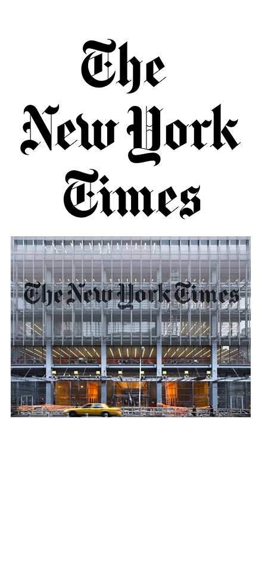

# Landing page The New York Times
El objetivo de este sitio web es presentar el nuevo servicio de podcast del periodico The New York Times

## Colores de la marca

La elección de los siguientes colores transmiten seriedad, neutralidad y autoridad. Estos colores reflejan los valores fundmentales del periodismo tradicional

- #000000 -- negro
- #FFFFFF -- blanco
- #808080 --gris

## Tipografía

La tipografia "UnifrakturMaguntia" clásica de la marca evoca el estilo editorial clásico de los grandes periódicos. Sus formas refinadas y contraste tipográfico le dan un carácter formal y atemporal.

## Propósito (metodologia de historia de usuario)

¿Quién?: Personas interesadas en formarse sobre actuaidad mundial y temas complejos de forma clara y accesible 

¿Qué necesita?: Estar al día con las noticias, comprender contextos complejos y consumir información confiable en un formato ágil que se adapte a su rutina diaria (como en el transporte, mientras caminan, hacen ejercicio, etc.)

¿Qué ofrece el servicio?: Un podcast diario con reportajes narrativos y análisis periodístico de alta calidad, producido por el equipo de periodistas de The New York Times, que traduce noticias complejas a un lenguaje cercano humano.

Beneficio final: El oyente se mantiene informado, entiende mejor el mundo en el que vive y confía en que la información que consume es verificada, profunda y presentada de forma atractiva y práctica

## Diseño Visual 

https://www.figma.com/design/ty0EJuS3USZoFxc7bZ1bBR/The-New-York-Times?node-id=0-1&m=dev&t=qsDPZNoiYGDUTfEi-1